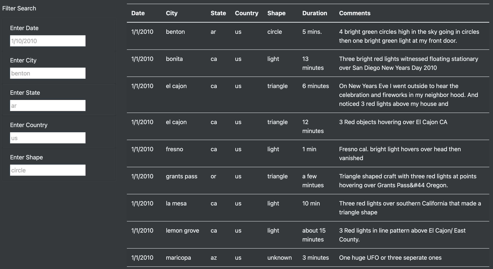
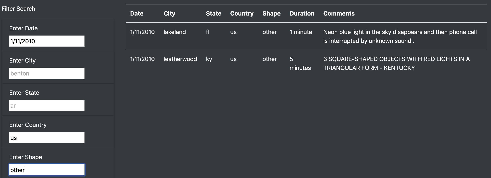

# UFO Sightings with Javascript

***University of Toronto - Data Analytics Boot Camp - Module 12 - UFO Sightings with Javascript***

---

# Dashboard Link

https://emadsoheili.github.io/JavaScript-UofT-UFOs/

---

## Overview of Project

The purpose of this project is creating an interactive webpage. In this page, there are some static data such as paragraphs and text and a dynamic table which can be filtered.
The previous project contained just one filter, but in this project multiple filter should be considered. This way we can see just a portion of data which we are interested in.

---

## Results

The page contains two parts.

  * Static: Header, Title, Paragraph, etc.

  * Dynamic: Table, and its Filters

For using the interactive dynamic part and filtering the table, un the left side of the screen, you can find 5 different input field. You can use one or more of this field for inputing your desired criteria considering the washout examples that have been written in these field by default. Therefore the content of table will be changed according to your added filters and only the rows that match your criteria will be displayed.

---

## Summary

### Drawback

Because the filters are looking for exact match, any kind of deviation from the table content can provide us with no matched content. For example, if we type US instead of us in country field, we have "zero" match for our filtering.

---

### Recommendation

  * We can add a input box for comments in order to search for a word or phrase in comments and deliver us matches.
  * We can add a some chart and summary statistics for convey a better mesage. For example, we can have a bar chart for the shape of the UFOs.
